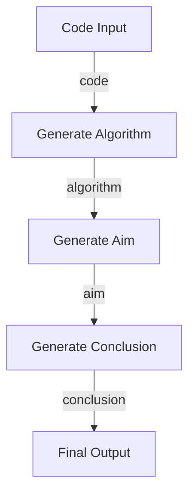

<<<<<<< HEAD
# BrainAFK
BrainAFK is a simple automation tool that generates aim, algorithm, and conclusion for C programs, allowing students to complete their DS records without manual effort. By leveraging LangChain and Streamlit, it takes a given C code as input and automatically structures the required documentation.
=======
# BrainAFK - Langchain Project 🤖  
### ✍️ Write DS Records Mindlessly!  

Tired of manually writing aim, algorithm, and conclusions for your C programs? **BrainAFK** lets you paste your code and generates everything automatically, so you can mindlessly complete your records while vibing to music!  

## 🚀 Features  
✅ Generates **Aim**, **Algorithm**, **Conclusion**, and more from C code  
✅ Displays your **code** neatly formatted  
✅ Works instantly—just **paste your C code & click a button**  

## Chain Architecture


## 🤡 Why This Exists?
Made this project to get used to LangChain

## 🛠 Requirements  
- **Python 3.x**  
- **Streamlit** (`pip install streamlit`)  

## 🏗 Installation  
```sh
git clone https://github.com/yourrepo/BrainAFK.git
cd BrainAFK
pip install -r requirements.txt


>>>>>>> dc34ed9 (Initial commit)
